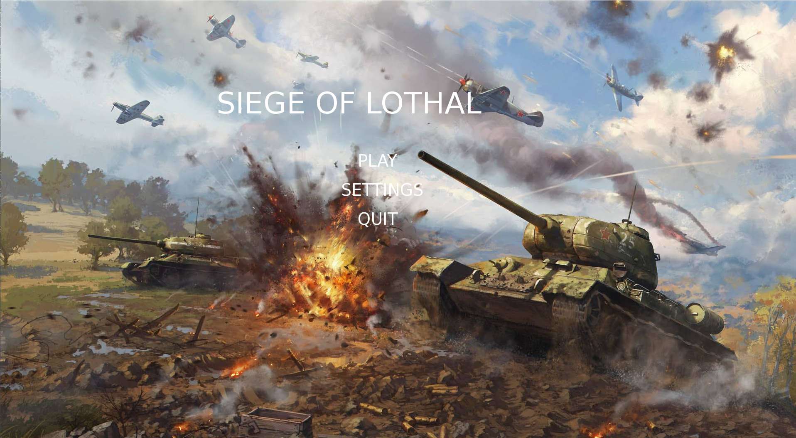
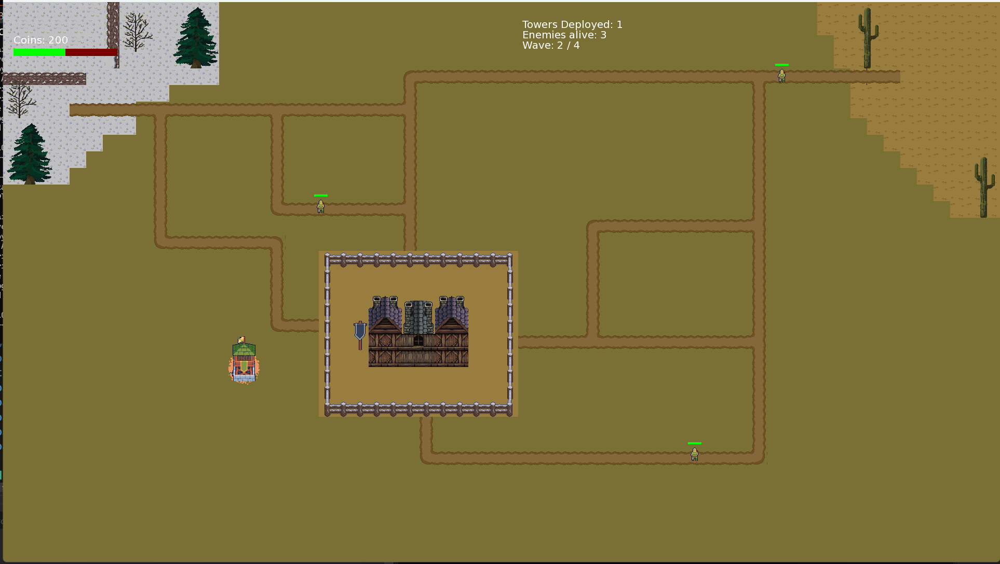

# 🏹 Tower Defense Game

A **tower defense game** built using **C++17** and **SFML**, focusing on real-time gameplay, enemy movement, and basic tower mechanics.

---

## 🎮 Overview

This project is a standalone implementation of a tower defense game where the player defends against enemy waves by placing towers strategically on a map.

It demonstrates core game development concepts such as:

* Game loop design
* Real-time rendering
* Input handling
* Basic enemy movement and interactions

---

## ✨ Features

* 🛡️ Tower placement system
* 👾 Enemy movement and path-following
* 🎯 Real-time rendering using SFML
* 🖱️ Mouse-based interaction
* 🧱 Basic game architecture using C++

---
## 🖼️ Screenshots



---

## ⚙️ Tech Stack

* **Language:** C++17
* **Graphics Library:** SFML

---

## 🚀 Getting Started

### 🔧 Prerequisites

* C++17 compatible compiler
* SFML installed and configured
* Visual Studio (recommended for this project)

---

### 🪟 Running the Project (Visual Studio)

1. Clone the repository:

```bash id="2yh5tz"
git clone https://github.com/Rafi-Sojan/Tower-Defense-Game.git
```

2. Open the solution file (`.sln`) in Visual Studio

3. Make sure SFML is properly linked:

   * Include directories
   * Library directories
   * DLLs available at runtime

4. Build and run the project

---

## 🎮 Controls

| Action          | Input       |
| --------------- | ----------- |
| Place Tower     | Left Click  |
| Toggle Tower    |     L       |   
| Upgrade window  | Right Click |
| Interact        | Mouse       |

---

## 📁 Project Structure (Current)

```id="4jqdhh"
Tower-Defense-Game/
│
├── Tower Defense Game/   # Main Visual Studio project folder
│   ├── Source.cpp        # Main source file
│   ├── *.vcxproj         # Project configuration
│   ├── *.filters
│   └── assets
│
├── Tower-Defense-Game.sln
├── README.md
└── .gitignore
```

---

## 🧠 Notes

* This project is currently structured around a **Visual Studio solution**
* Some files (e.g., `.vcxproj`, `.filters`) are IDE-specific
* Future improvements may include restructuring for cross-platform builds

---

## 🚧 Future Improvements

* Better project structure (separating source and assets)
* Cross-platform support (Linux/Ubuntu)
* Advanced enemy AI
* Tower upgrades and abilities
* Improved UI and game polish

---

## 🤝 Contributing

Feel free to fork the repository and improve the project.

---

## 📜 License

No license specified yet.

---

## 👤 Author

**Rafi Sojan**

---

